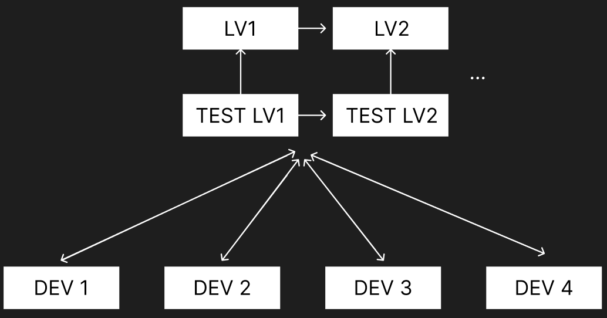

### **Cahier des Charges - EasySave Version 1.0**

---

#### **1. Objectif du Logiciel**
EasySave 1.0 est une application console développée avec .Net Core. Son objectif est de permettre la gestion et l’exécution de travaux de sauvegarde (backup) de manière simple et efficace, tout en garantissant une compatibilité pour des utilisateurs anglophones et francophones.

---

#### **2. Fonctionnalités Principales**

##### **2.1 Gestion des Travaux de Sauvegarde**
- Possibilité de créer **jusqu'à 5 travaux de sauvegarde**.
- Définition d’un travail de sauvegarde par :
  - **Nom** du travail.
  - **Répertoire source**.
  - **Répertoire cible**.
  - **Type de sauvegarde** :
    - Sauvegarde complète.
    - Sauvegarde différentielle.
- Prise en charge des répertoires situés sur :
  - Disques locaux.
  - Disques externes.
  - Lecteurs réseaux.

##### **2.2 Exécution des Sauvegardes**
- Exécution à la demande d’un ou plusieurs travaux de sauvegarde.
- Exécution séquentielle de l’ensemble des travaux.
- Commandes utilisables en ligne de commande pour l’exécution automatique :
  - **Exemple 1** : `1-3` pour exécuter les sauvegardes 1 à 3.
  - **Exemple 2** : `1;3` pour exécuter les sauvegardes 1 et 3.

##### **2.3 Sauvegarde Complète des Répertoires**
- Tous les fichiers et sous-répertoires d’un répertoire source sont inclus dans la sauvegarde.

---

#### **3. Journalisation et Suivi des Sauvegardes**

##### **3.1 Fichier Log Journalier**
- Écriture en temps réel des actions réalisées dans un fichier log journalier au format JSON.
- Contenu minimal pour chaque action :
  - **Horodatage**.
  - **Nom de sauvegarde**.
  - **Adresse complète** du fichier source (format UNC).
  - **Adresse complète** du fichier de destination (format UNC).
  - **Taille du fichier**.
  - **Temps de transfert** en millisecondes (valeur négative si erreur).
- Le fichier doit permettre une lecture facile via Notepad, avec des retours à la ligne entre les éléments JSON.

##### **3.2 Fichier d'État en Temps Réel**
- Enregistrement en temps réel de l’état des travaux dans un fichier unique au format JSON.
- Informations minimales enregistrées pour chaque travail :
  - **Nom du travail**.
  - **Horodatage** de la dernière action.
  - **État** (ex. : Actif, Non Actif...).
  - Si actif :
    - **Nombre total de fichiers** éligibles.
    - **Taille totale** des fichiers à transférer.
    - **Progression**.
    - **Nombre de fichiers restants**.
    - **Taille des fichiers restants**.
    - **Adresse complète** du fichier source en cours.
    - **Adresse complète** du fichier de destination.

---

#### **4. Contraintes Techniques**

##### **4.1 Compatibilité et Configuration**
- Les emplacements des fichiers (log journalier et état) doivent être compatibles avec les serveurs clients. Les emplacements temporaires comme `c:\temp\` sont proscrits.
- Format JSON obligatoire pour tous les fichiers (log, état, et configurations éventuelles).

##### **4.2 Modularité (facultatif)**
- Développement de la fonctionnalité de journalisation (log) sous forme de **Dynamic Link Library (DLL)**.
- La DLL doit rester compatible avec la version 1.0, même lors d’évolutions futures.

##### **4.3 Pagination (facultatif)**
- Pagination des fichiers JSON pour faciliter la lecture rapide.

---

#### **5. Évolutions Futures**
Si la version 1.0 est jugée satisfaisante, une **version 2.0** avec une interface graphique (architecture MVVM) sera développée.

---
#### **5. Contraintes**
- **Outils** :
  - Visual studio 2022
  - PlantUML
  - WPF
  - Package nuget
  - Github : 
    - Convention de commit :
      - type : correspondant à une information sur le type de rajout ou de décrément de
        contenu dans le commit (par exemple fix, feat, test, init, docs, etc),
      - sujet (scope) : équivaut à l’information de la modification effectuée (style, logic,
        structure, documentation,...)
      - description : détails des modifications comme dans un commit sans convention
    - Workflow :

      

      Chaque développeur travaille sur sa propre branche. Lorsqu'il effectue un commit pour 
      ajouter une nouvelle fonctionnalité, corriger un bug ou toute autre modification, un merge 
      est effectué vers une branche TEST dédiée au livrable en cours, par exemple, `TEST-lv1`. Une fois les modifications
      validées, elles sont ensuite poussées sur une branche MAIN spécifique au même livrable, par exemple, `lv1`.

      Lorsqu'un nouveau livrable débute, une nouvelle paire de branches est créée : une branche TEST 
      pour les développements (`TEST-lv2`) et une branche MAIN pour les livraisons finales (`lv2`).
      Ces nouvelles branches partent de l'état final de la branche MAIN du livrable précédent (par exemple, `lv1`), 
      garantissant ainsi une continuité et une base de travail stable pour le nouveau cycle de développement.

- **Langages et Frameworks** :
  - C#
  - Dotnet 8.0
  - Architecture logiciel extensible
  - Convention de nommage :
    - Les conventions de nommage dans un projet C# sont essentielles pour garantir la lisibilité et la cohérence de notre code. 
    Concernant les conventions générales de programmation, on utilise le PascalCase et le camelCase. 
    - Le PascalCase est utilisé pour les noms publics dont les noms de classe, les méthodes ou encore les propriétés.
    - Le camelCase est utilisé pour les noms privés, locaux ou encore les paramètres.

---

### **Conclusion**
EasySave 1.0 vise à fournir une solution de sauvegarde simple, configurable, et extensible. La compatibilité multi-plateforme, le suivi en temps réel et la journalisation détaillée sont au cœur de ce projet, offrant ainsi une base solide pour des évolutions ultérieures.