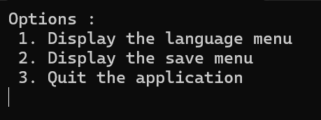
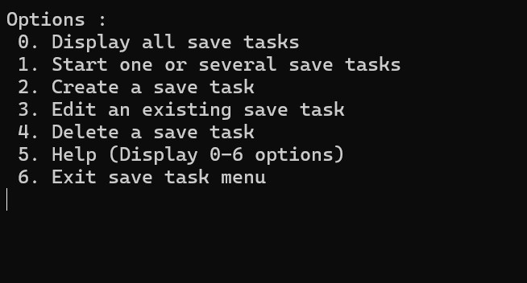

<!-- PROJECT LOGO -->
<br />
<div align="center">
  <a href="https://github.com/NoahAldahan/FISA_A3_GL_Aldahan">
    
  </a>

<h3 align="center">EasySave</h3>

  <p align="center">
    CESI FISA 3ème année
  </p>
</div>


<!-- TABLE OF CONTENTS -->
<details>
  <summary>Table of Contents</summary>
  <ol>
    <li>
      <a href="#about-the-project">About The Project</a>
      <ul>
        <li><a href="#built-with">Built With</a></li>
      </ul>
    </li>
    <li>
      <a href="#getting-started">Getting Started</a>
      <ul>
        <li><a href="#installation">Installation</a></li>
      </ul>
    </li>
    <li><a href="#usage">Usage</a></li>
    <li><a href="#roadmap">Roadmap</a></li>
    <li><a href="#contributors">Contributors</a></li>
  </ol>
</details>


<!-- ABOUT THE PROJECT -->
## About The Project


EasySave is a backup software developed as part of a structured project within ProSoft. The project simulates an accelerated development cycle, covering multiple versions of the software. The goal is to design, implement, and document a robust and maintainable backup solution using C# and .NET 8.0, while adhering to best practices in version control, code quality, and user documentation. The software is designed to be distributed to clients, requiring well-structured UI/UX and efficient backup functionality.


### Built With

- Visual Studio
- C# 
- .NET


<!-- GETTING STARTED -->
## Getting Started


### Installation

To use the application :

Download the exe of the version you want in the releases and execute it.

To access and modify source code :
- Visual Studio 2022
```
Download and install from this link
https://visualstudio.microsoft.com/fr/
When installing Visual Studio, make sure to check :
- Multiplatform development
- .NET native
- kit SDK .NET
- .NET Framework
```

- System.Text.Json
```
In Visual Studio, open Project, Manage NuGetPackages
Search for System.Text.JSON and install it
```
- DotNetEnv
```
In Visual Studio, open Project, Manage NuGetPackages
Search for DotNetEnv and install it
```


<!-- USAGE EXAMPLES -->
## Usage

Here are the options you might find in the CLI application :



_For a step by step explanation, please refer to the [user guide](Documentation/UserGuide.pdf)_


<!-- ROADMAP -->
## Roadmap

- [ ] Version 1
    - [ ] Version 1.1
- [ ] Version 2
- [ ] Version 3

## Contributors

* [Romain](https://github.com/Romain68)
* [Jean](https://github.com/Yamigiri1)
* [Mattéo](https://github.com/Mattbalaise)
* [Noah](https://github.com/NoahAldahan)

<p align="right">(<a href="#readme-top">back to top</a>)</p>
