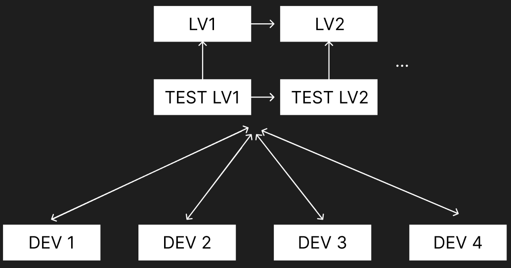
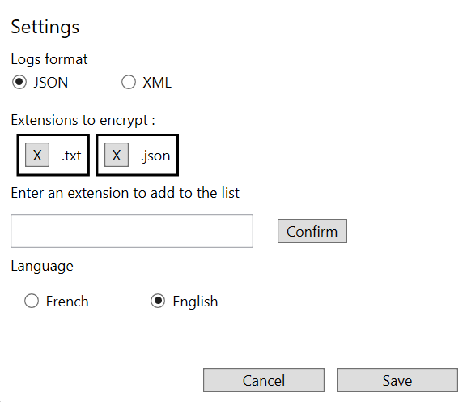

<!-- PROJECT LOGO -->
<br />
<div align="center">
  <a href="https://github.com/NoahAldahan/FISA_A3_GL_Aldahan">
    
  </a>
</div>

<h3 align="center">EasySave</h3>

#### **1. A propos**
EasySave 2.0 est une application console développée avec .Net Core. Son objectif est de permettre la gestion et l’exécution de travaux de sauvegarde (backup) de manière simple et efficace, tout en garantissant une compatibilité pour des utilisateurs anglophones et francophones.

---

#### **2. Journalisation et Suivi des Sauvegardes**

##### **2.1 Fichier Log Journalier**
- Écriture en temps réel des actions réalisées dans un fichier log journalier au format JSON.
- Contenu minimal pour chaque action :
  - **Horodatage**.
  - **Nom de sauvegarde**.
  - **Adresse complète** du fichier source (format UNC).
  - **Adresse complète** du fichier de destination (format UNC).
  - **Taille du fichier**.
  - **Temps de transfert** en millisecondes (valeur négative si erreur).
- Le fichier doit permettre une lecture facile via Notepad, avec des retours à la ligne entre les éléments JSON.

##### **2.2 Fichier d'État en Temps Réel**
- Enregistrement en temps réel de l’état des travaux dans un fichier unique au format JSON.
- Informations minimales enregistrées pour chaque travail :
  - **Nom du travail**.
  - **Horodatage** de la dernière action.
  - **État** (ex. : Actif, Non Actif...).
  - Si actif :
    - **Nombre total de fichiers** éligibles.
    - **Taille totale** des fichiers à transférer.
    - **Progression**.
    - **Nombre de fichiers restants**.
    - **Taille des fichiers restants**.
    - **Adresse complète** du fichier source en cours.
    - **Adresse complète** du fichier de destination.

---

#### **3. Contraintes Techniques**

##### **3.1 Compatibilité et Configuration**
- Les emplacements des fichiers (log journalier et état) doivent être compatibles avec les serveurs clients. Les emplacements temporaires comme `c:\temp\` sont proscrits.
- Format JSON ou XML obligatoire pour tous les fichiers (log, état, et configurations éventuelles).

---
#### **4. Contraintes**
- **Outils** :
  - Visual studio 2022
  - Windows Presentation Foundation
  - PlantUML
  - WPF
  - Package nuget
  - Pipeline (déploiement / test)
  - Github : 
    - Convention de commit :
      - type : correspondant à une information sur le type de rajout ou de décrément de
        contenu dans le commit (par exemple fix, feat, test, init, docs, etc),
      - sujet (scope) : équivaut à l’information de la modification effectuée (style, logic,
        structure, documentation,...)
      - description : détails des modifications comme dans un commit sans convention
    - Workflow :

      

      Chaque développeur travaille sur sa propre branche. Lorsqu'il effectue un commit pour 
      ajouter une nouvelle fonctionnalité, corriger un bug ou toute autre modification, un merge 
      est effectué vers une branche TEST dédiée au livrable en cours, par exemple, `TEST-lv1`. Une fois les modifications
      validées, elles sont ensuite poussées sur une branche MAIN spécifique au même livrable, par exemple, `lv1`.

      Lorsqu'un nouveau livrable débute, une nouvelle paire de branches est créée : une branche TEST 
      pour les développements (`TEST-lv2`) et une branche MAIN pour les livraisons finales (`lv2`).
      Ces nouvelles branches partent de l'état final de la branche MAIN du livrable précédent (par exemple, `lv1`), 
      garantissant ainsi une continuité et une base de travail stable pour le nouveau cycle de développement.

- **Langages et Frameworks** :
  - C#
  - Dotnet 8.0
  - Architecture logiciel extensible
  - Convention de nommage :
    - Les conventions de nommage dans un projet C# sont essentielles pour garantir la lisibilité et la cohérence de notre code. 
    Concernant les conventions générales de programmation, on utilise le PascalCase et le camelCase. 
    - Le PascalCase est utilisé pour les noms publics dont les noms de classe, les méthodes ou encore les propriétés.
    - Le camelCase est utilisé pour les noms privés, locaux ou encore les paramètres.


<!-- GETTING STARTED -->
## Installer le projet

### Installation

Pour utiliser l'application :

Télecharger l'application .exe de la version de votre choix dans les releases et lancez-la.

Pour accéder et modifier le code source :
- Visual Studio 2022
```
Téléchargez et installez depuis ce lien Visual Studio 2022
https://visualstudio.microsoft.com/fr/
Lorsque vous installez Visual Studio, pensez à cocher ces options :
- Multiplatform development
- .NET native
- kit SDK .NET
- .NET Framework
```

- System.Text.Json
```
Dans Visual Studio, ouvrez Project, et cliquez sur Manage NuGetPackages
Cherchez System.Text.JSON et installez le
```
- DotNetEnv
```
Dans Visual Studio, ouvrez Project, et cliquez sur Manage NuGetPackages
Cherchez DotNetEnv et installez le
```


<!-- USAGE EXAMPLES -->
## Utilisation

Voici quelques images de ce qu'il peut vous attendre dans EasySave 2.0 :


_Pour une explication étape par étape, référez vous au ([guide utilisateur](Documentation/GuideUtilisateur.pdf)), [user guide](Documentation/UserGuide.pdf)_


<!-- ROADMAP -->
## Roadmap

- [x] Version 1
    - [x] Version 1.1
- [x] Version 2
- [ ] Version 3

## Contributeurs

* [Romain](https://github.com/Romain68)
* [Jean](https://github.com/Yamigiri1)
* [Mattéo](https://github.com/Mattbalaise)
* [Maxime Noah](https://github.com/NoahAldahan)
