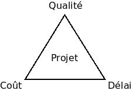

# SYNTHESE : GENIE LOGICIEL

## Génie logiciel

Le génie logiciel est une discipline qui consiste à concevoir, développer, tester, maintenir et gérer des logiciels de manière structurée et méthodique. L'objectif est de créer des logiciels fiables, performants, évolutifs et adaptés aux besoins des utilisateurs, en utilisant des bonnes pratiques, des outils et des méthodologies bien définis.

Le génie logiciel inclut plusieurs dimensions, dont, entre autres :

- L’analyse des besoins du client
- Définition de l’architecture logicielle
- Choix de conception
- Règles et méthodes de production du code source
- Gestion des versions
- Test du logiciel
- Documentation
- Organisation de l’équipe

La réalisation d’un logiciel dépend de 3 exigences contradictoires et difficilement compatibles :

## Résumé

En conclusion, le génie logiciel représente une discipline essentielle pour garantir la conception et le développement de logiciels répondant aux attentes des utilisateurs tout en respectant les contraintes inhérentes aux projets. En intégrant des méthodologies rigoureuses et des outils performants, il vise à trouver un équilibre délicat entre coûts, délais et qualité. Cette démarche structurée permet de concevoir des logiciels robustes, évolutifs et adaptés à des besoins en constante évolution, tout en valorisant la collaboration et l'organisation au sein des équipes de développement.
